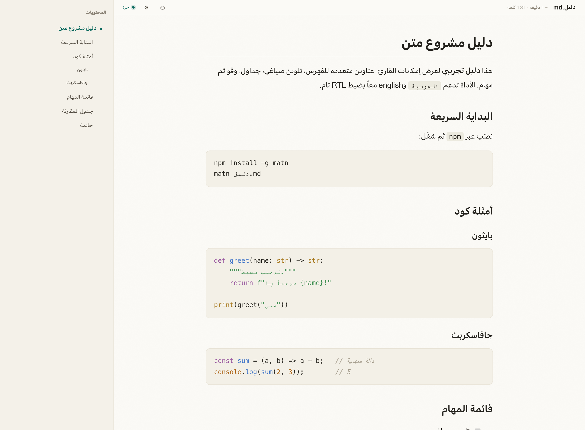
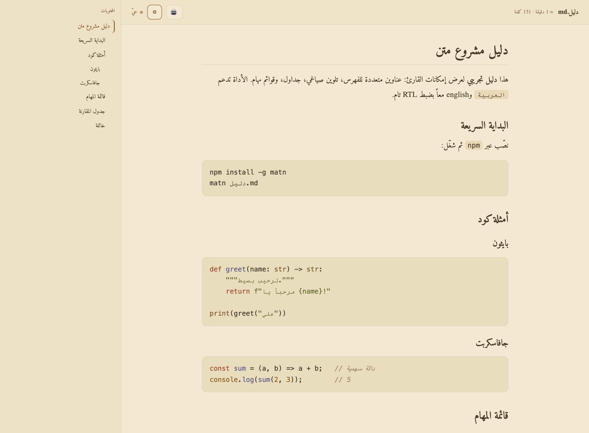
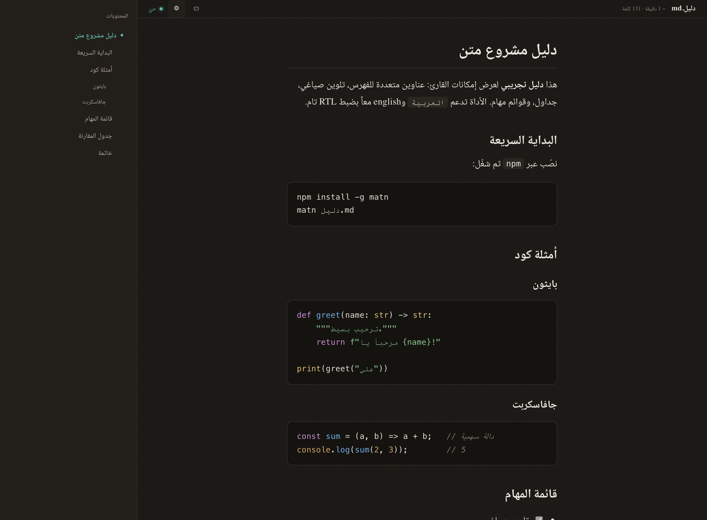
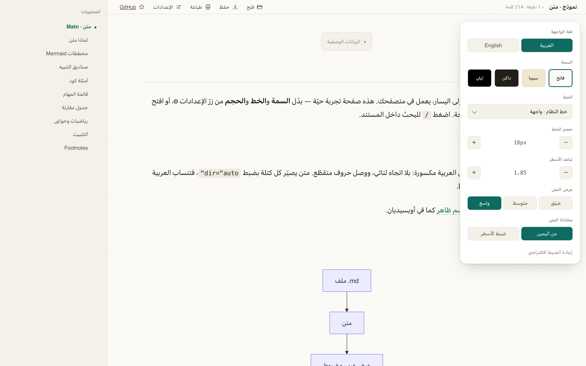

# متن · Matn

**A right-to-left Markdown reader for Arabic.**
Reading themes, embedded Arabic fonts, math, diagrams, and export — all in your browser, fully offline.

**[▶ Try the live demo](https://ajarallah.github.io/matn/)**

**[العربية →](./README.md)**

[](./LICENSE)
[](https://github.com/Ajarallah/matn/releases)




---

## Why

Terminals and many editors mangle Arabic Markdown: no bidirectional reordering,
broken letter-joining, mixed Arabic/Latin lines collapsing, and a heading that
merely starts with a Latin word flips the whole line to left-to-right. **Matn**
renders your `.md` in the browser as a genuine right-to-left document — Arabic
flows RTL while code and English read LTR inside it — wrapped in a reading
experience built for long-form Arabic.

## Features

**Reading**

- 🪶 **True RTL** — the document follows its *dominant* language, so an Arabic file stays right-to-left even when a heading or line starts with Latin. Latin runs still read left-to-right within the line.
- 🎨 **Four themes** — Light · Sepia · Dark · Night (OLED black); follows your system by default.
- 🔤 **Arabic fonts, embedded** — System, Noto Naskh, Amiri, IBM Plex Sans Arabic, Tajawal (all SIL OFL, bundled, **offline**). Optional Thmanyah Display + Text.
- 🔧 **Reading controls** — font, size, line-height, column width, and text alignment (start / justify); every choice is saved locally.
- 🌍 **Bilingual interface** — switch the whole UI between Arabic and English.

**Content**

- 🌈 **Syntax highlighting** — theme-aware, via highlight.js.
- 🧮 **Math** — inline `$…$` and block `$$…$$` rendered with KaTeX, offline.
- 📊 **Mermaid diagrams** — rendered inline and theme-aware; hover to magnify.
- 💬 **GFM callouts** — `> [!NOTE]`, `[!TIP]`, `[!WARNING]`, … styled per type.
- 🔗 **Wikilinks** — `[[page]]` and `[[page|alias]]`, like Obsidian.
- 📝 **Footnotes**, a **YAML frontmatter card**, task lists, tables, blockquotes.
- 🖼️ **Hover zoom** — magnify diagrams and images at the cursor.

**Navigation & files**

- 🧭 **Table of contents** — auto-generated, with scroll-spy and heading anchors.
- 🗂️ **File tree** — open a folder to browse a nested, collapsible directory tree.
- 🔎 **In-document search** — press `/` to find and jump between matches.
- ♻️ **Live reload** — edit in any editor; the view updates on save.
- 🐘 **Responsive large files** — documents over 2MB render in a Worker and load progressively without freezing the reader.
- 🖱️ **Drag & drop** any `.md` onto the window.

**Output**

- 📤 **Export** — PDF, standalone HTML, Word (`.docx`), EPUB 3 (RTL page progression), or raw Markdown.
- 🖨️ **Print** — a clean print layout.

**Foundations**

- 📦 **Zero runtime dependencies** — pure Node plus vendored assets, fully offline; never phones home.
- 🔒 **Contained** — binds to `127.0.0.1`, serves only from the folder you opened, escapes raw HTML, and blocks unsafe URL schemes.

## Screenshots

| Sepia · Amiri | Dark · syntax + math |
|---|---|
|  |  |

| Reading settings |
|---|
|  |

## Install

**Global (from GitHub):**
```bash
npm install -g Ajarallah/matn
matn README.md
```

**Run without installing:**
```bash
npx github:Ajarallah/matn README.md
```

**From source:**
```bash
git clone https://github.com/Ajarallah/matn.git
cd matn && npm link
matn README.md
```

> Requires Node.js ≥ 18. No other dependencies.

## Usage

```bash
matn <file.md>        # open a single file
matn ./docs           # browse a folder (file-tree sidebar)
matn                  # open the current directory
matn PLAN.md -p 5000  # custom port
```

Options: `-p, --port` · `--host` · `--no-open` · `-h, --help` · `-v, --version`.

Matn opens your browser automatically and reuses a running instance, so `matn a.md`
then `matn b.md` both land in the same window.

### In the browser

- Click **⚙** for explained reading modes, language, theme, font, size, line-height, width, and alignment — all remembered.
- **Select text once** to highlight it, add a note, save the excerpt to Favorites, or copy it with a source link.
- **Hover a document-map line** to preview its heading, click it to jump there, or open the list button for every heading.
- **Drag** any `.md` onto the window to open it.
- **Save ▾** exports PDF / HTML / Word / EPUB / Markdown; **🖨️** prints.
- Press **/** to search. Keys: `+` / `−` size · `g` / `G` top / bottom · `Esc` close the panel.

## Open `.md` on double-click

**macOS** — make Matn the default reader for Markdown, in one step:

```bash
bash scripts/install-macos.sh --default
```

This builds a small Finder app and registers it for `.md`. To point an existing
install manually: **Get Info → Open with → Change All**.

**Linux** — `bash scripts/install-linux.sh --default` adds a `.desktop` entry and
makes Matn the handler for `text/markdown`.
**Windows** — `matn file.md` works from any shell; associate `.md` via
*Open with → Choose another app* pointing at `matn`.

## How it works

Matn is a small local HTTP server (`src/server.mjs`, no dependencies). It renders
Markdown with [marked](https://github.com/markedjs/marked), gives each text block
the document's dominant direction for correct bidi, highlights code with
[highlight.js](https://github.com/highlightjs/highlight.js), renders math with
[KaTeX](https://katex.org) and diagrams with [Mermaid](https://mermaid.js.org)
(both lazy-loaded), and pushes live-reload events over Server-Sent Events. Fonts
and libraries are vendored, so it runs fully offline and never phones home.

## Security

Matn binds to `127.0.0.1` by default and serves Markdown plus referenced raster
images only from the file or folder you opened. Raw HTML in Markdown is escaped,
and unsafe link schemes such as `javascript:` are blocked. Avoid `--host 0.0.0.0`
unless you intentionally want other devices on your network to reach the reader.
See [SECURITY.md](./SECURITY.md).

## Credits & licenses

- Code: **MIT** — see [LICENSE](./LICENSE).
- Fonts: **SIL OFL 1.1** — Amiri, Noto Naskh Arabic, IBM Plex Sans Arabic, Tajawal.
- Libraries: [marked](https://github.com/markedjs/marked) (MIT),
  [highlight.js](https://github.com/highlightjs/highlight.js) (BSD-3-Clause),
  [KaTeX](https://katex.org) (MIT), [Mermaid](https://mermaid.js.org) (MIT),
  marked-footnote (MIT), html-docx-js (MIT), JSZip (MIT).

Full third-party notices in [NOTICE](./NOTICE).

## Contributing

Issues and PRs welcome. Roadmap: presentation mode, more themes and font
pairings. See the [CHANGELOG](./CHANGELOG.md).

---

Made by [Ali Aljarallah](https://github.com/Ajarallah). **متن** — the core text of a book.
