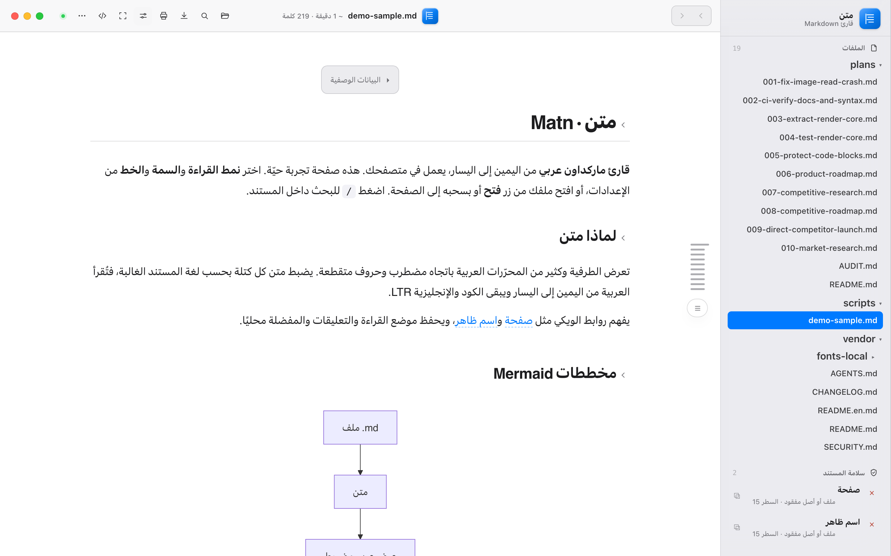
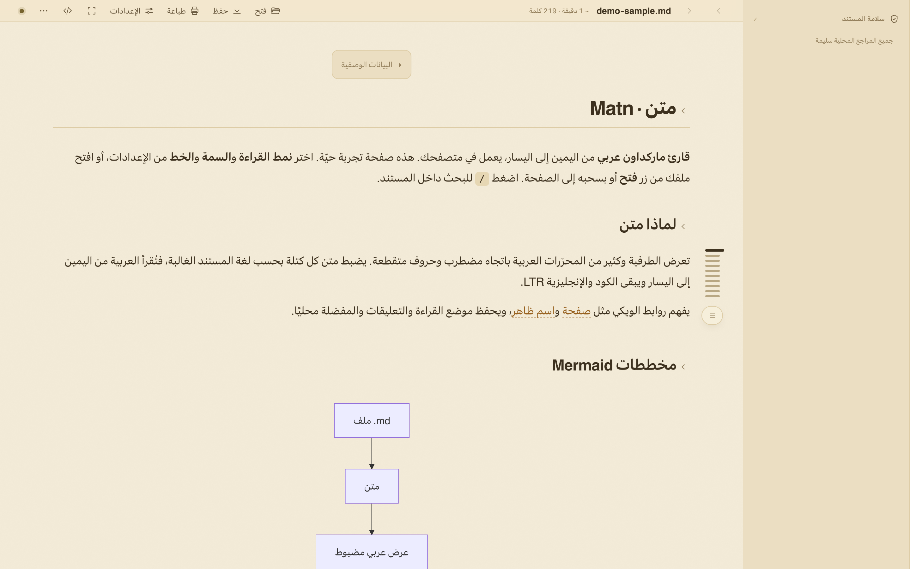
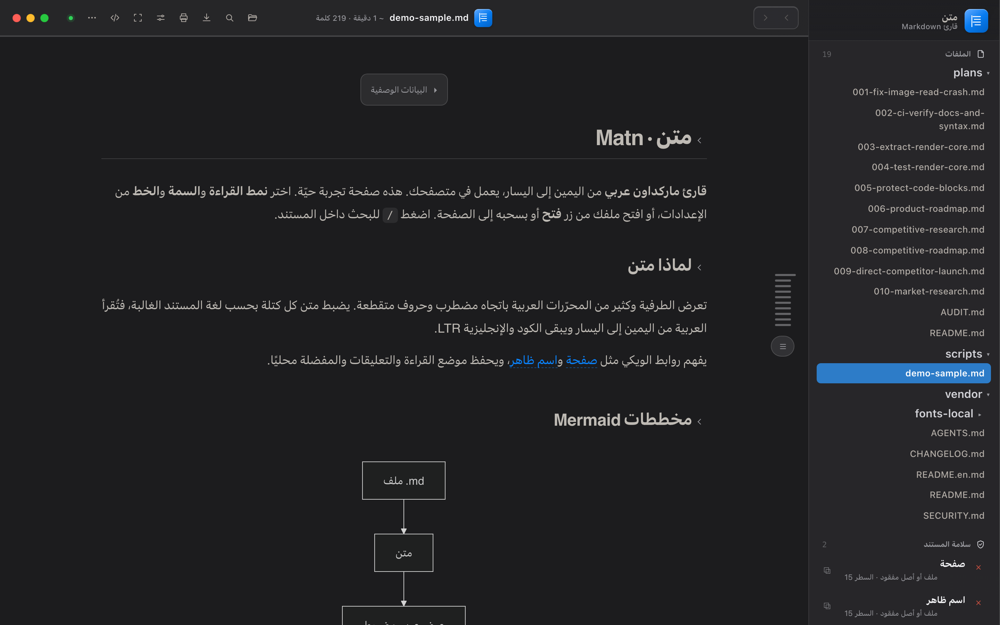
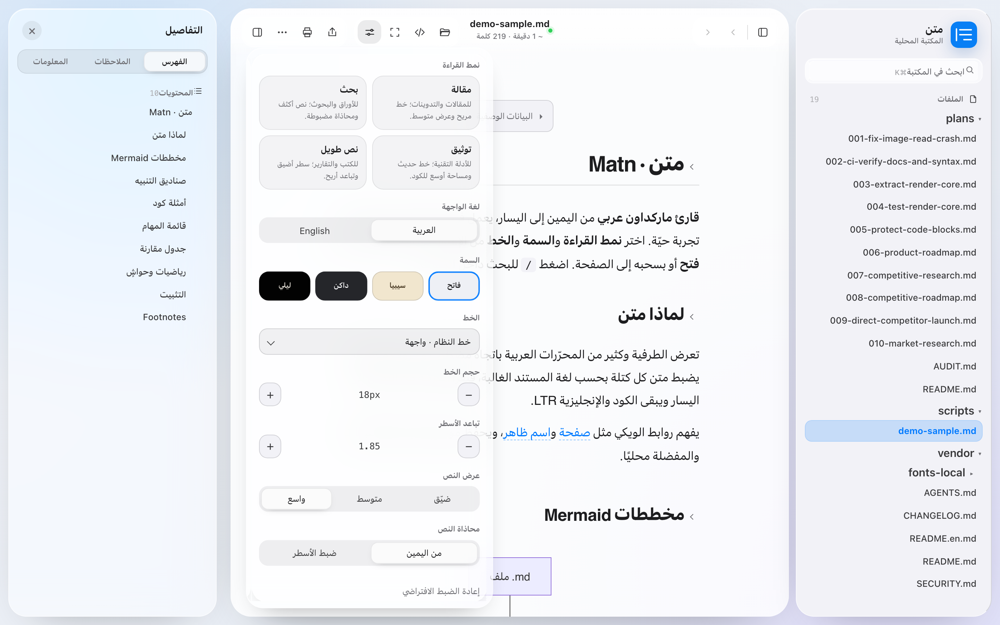

<div align="center">

# متن · Matn

### Arabic Markdown, rendered the way it should be

A local reader that gives Arabic true RTL layout while code and English remain clear and correctly directed.

[Try Matn in your browser](https://ajarallah.github.io/matn/) · [Quick start](#quick-start) · [Screenshots](#screenshots) · [العربية](./README.md)

[](./LICENSE)
[](https://github.com/Ajarallah/matn/releases)


</div>



## Why Matn?

Many editors and terminals mishandle Arabic Markdown: direction flips, English runs collide with Arabic, and a heading can become LTR merely because it starts with a Latin word. Matn renders your `.md` in the browser as a genuine Arabic document designed for comfortable long-form reading.

| Correct Arabic | Local and private | A complete reader |
|---|---|---|
| Detects the document's dominant language and preserves Arabic and Latin direction within the same line. | Works offline, binds locally to `127.0.0.1`, and never sends your files to a service. | Adds navigation, search, themes, annotations, book mode, and export without changing your Markdown. |

## Quick start

Install the package and open any file:

```bash
npm install -g @ajarallah/matn
matn README.md
```

Or run it without installing:

```bash
npx @ajarallah/matn README.md
```

Matn requires Node.js 18 or newer. It has no runtime dependencies and needs no build step.

## What you get

- **Correct Arabic reading:** reliable bidirectional text, four themes, embedded Arabic fonts, and controls for type, size, spacing, width, and alignment.
- **Rich content offline:** syntax highlighting, KaTeX math, Mermaid diagrams, footnotes, GFM callouts, and wikilinks.
- **Navigation that remembers:** a document map, search, file tree, reading position, favorites, and a read-later list.
- **Complete reading spaces:** open a folder or use `SUMMARY.md` for book mode with previous, next, and overall progress.
- **Annotations without source changes:** highlight text, add notes, and save excerpts without modifying the Markdown file.
- **Shareable output:** export PDF, standalone HTML, Word, EPUB 3, or Markdown, and print with a clean layout.

<details>
<summary><strong>View the complete feature list</strong></summary>

### Reading

- Follows the document's dominant language while keeping English and code LTR.
- Light, Sepia, Dark, and Night themes, with automatic system-theme detection.
- Embedded System, Noto Naskh, Amiri, IBM Plex Sans Arabic, and Tajawal fonts, plus optional Thmanyah fonts.
- Arabic and English interfaces with locally saved reading preferences.

### Content and navigation

- Syntax highlighting, KaTeX math, Mermaid diagrams, GFM callouts, footnotes, and YAML frontmatter.
- Wikilinks and relative links with previews and backlinks, plus a local document-health report.
- Document map, search, file tree, book mode, and live reload on save.
- Progressive Worker rendering for files over 2 MB, plus drag and drop for `.md` files.
- Optional safe move to the system Trash with warnings for Git files and backlinks.

### Formats and output

- Opens `.md`, `.markdown`, `.mdown`, `.mkdn`, `.mkd`, `.mdwn`, `.mdtxt`, `.mdtext`, `.rmd`, and `.qmd`.
- Exports PDF, HTML, Word, EPUB 3, and Markdown, with a dedicated print layout.

</details>

## Screenshots

| Sepia with Amiri | Dark with syntax and math |
|---|---|
|  |  |

<details>
<summary><strong>Reading settings</strong></summary>



</details>

## Usage

```bash
matn <file.md>        # open one file
matn ./docs           # browse a folder from the file tree
matn                  # open the current directory
command | matn -      # read Markdown from stdin
matn PLAN.md -p 5000  # choose a port
```

Options: `-p, --port` · `--host` · `--no-open` · `--editor <executable>` · `--allow-file-actions` · `--stdin-name <name>` · `-h, --help` · `-v, --version`.

Matn opens the browser automatically and reuses a running instance. Press `/` to search, use `</>` to switch between rendered, source, and split views, and choose **Save** to export.

<details>
<summary><strong>Make Matn the default Markdown reader</strong></summary>

**macOS**

```bash
bash "$(npm root -g)/@ajarallah/matn/scripts/install-macos.sh" --default
```

The command creates a small Finder app and registers the Markdown formats without Homebrew or `duti`. To undo it:

```bash
bash "$(npm root -g)/@ajarallah/matn/scripts/install-macos.sh" --uninstall
```

**Linux:** run `bash scripts/install-linux.sh --default` to add a `.desktop` entry and associate `text/markdown` with Matn.

**Windows:** `matn file.md` works from any shell. Associate `.md` through **Open with → Choose another app**.

</details>

## How it works

Matn runs a small local HTTP server with no runtime dependencies. It renders Markdown with [marked](https://github.com/markedjs/marked), assigns each block the document's dominant direction, highlights code with [highlight.js](https://github.com/highlightjs/highlight.js), and renders math with [KaTeX](https://katex.org) and diagrams with [Mermaid](https://mermaid.js.org). Server-Sent Events provide live reload, while vendored libraries and fonts keep everything offline.

## Security

Matn binds to `127.0.0.1` by default and serves files only from the file or folder you opened. It escapes raw HTML and blocks unsafe schemes such as `javascript:`. Use `--host 0.0.0.0` only when you intentionally want other devices on your network to reach the reader. Read the [security policy](./SECURITY.md).

## Development and contributing

```bash
git clone https://github.com/Ajarallah/matn.git
cd matn
npm install
npm run check
npm test
```

Issues and pull requests are welcome. See the [changelog](./CHANGELOG.md) and [third-party notices](./NOTICE). Matn is available under the [MIT License](./LICENSE).

> The published package is `@ajarallah/matn` because the bare `matn` name on npm belongs to another package. The executable remains `matn`.

---

<div align="center">

Made by [Ali Aljarallah](https://github.com/Ajarallah) · **متن** means the core text of a book

</div>
