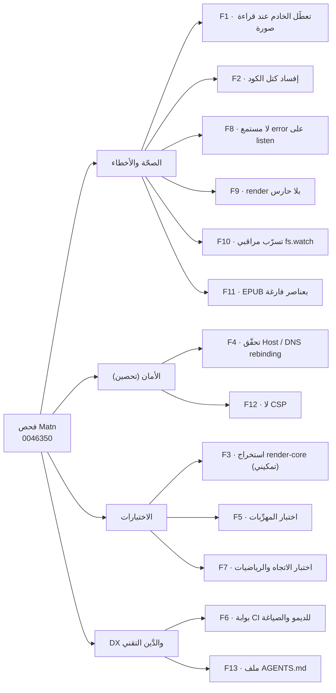
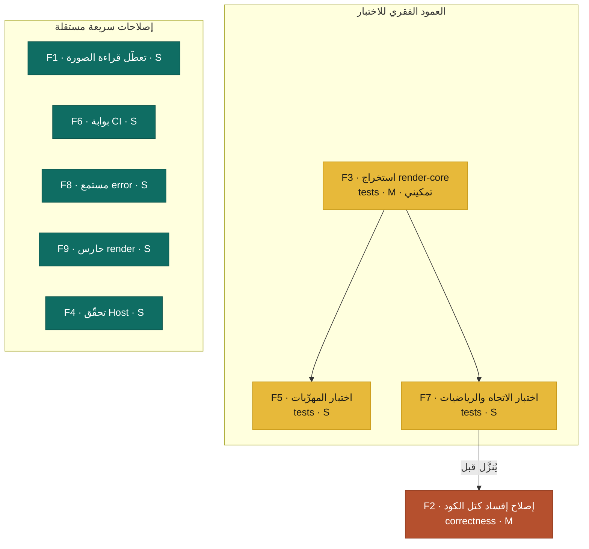
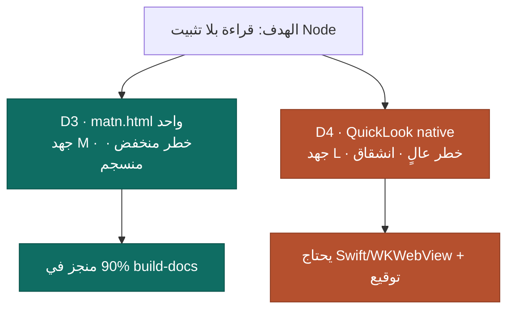

# تقرير فحص Matn

> فحص بمنهجية `/improve` (مستشار، لا منفّذ) — القراءة فقط، بلا تعديل شيفرة.
> **اللقطة:** commit `0046350` · **التاريخ:** 2026-07-08 · **الإصدار:** 1.2.7

## النطاق

- **فُحص:** `src/server.mjs`، `bin/matn.mjs`، كامل خط العرض المضمّن في `src/index.html`، الاختبارات، البنية، والأدوات.
- **لم يُفحص:** المكتبات المضمّنة (marked / katex / mermaid / highlight.js)، سكربتات التثبيت (`install-*.sh`)، والأداء (أداة محلية أحادية المستخدم — لا مسار حرج للأداء عدا تسرّب المراقبين F10).
- **نظيف ومتحقَّق:** لا ثغرة XSS مستغَلّة، لا ReDoS، ولا خلل في احتواء المسارات — `esc` / `safeHref` / `safeRenderer` (مع marked v12 positional API) والـ `realpathSync` + `withinRoot` سليمة. الأمان أدناه **تحصين دفاعي**، لا ثغرات فاعلة.

---

## شجرة النتائج حسب الفئة

---

## جدول النتائج (مرتّب بالرافعة)

| # | النتيجة | الفئة | الأثر | الجهد | الخطر | الثقة | الدليل |
|---|---------|-------|:-----:|:-----:|:-----:|:-----:|--------|
| **F1** | قراءة الصورة `readFileSync` بلا حارس ← استثناء (EACCES/TOCTOU) يُسقط **الخادم كله** ويُسقط كل العملاء | bug | عالٍ | S | LOW | HIGH | `src/server.mjs:151` |
| **F2** | المعالِجات قبل marked تُفسد كتل الكود: استخراج `$…$`/`$$…$$` وتجريد `
` يعملان على النص الخام دون وعي بالكود | correctness | عالٍ | M | MED | HIGH ✅ | `src/index.html:553-558` |
| **F3** | خط العرض غير قابل للاختبار: الدوال النقية محبوسة في `<script>` مضمّن (‏14/18 التزام، صفر تغطية) | tests | عالٍ | M | MED | HIGH | `src/index.html:383` |
| **F4** | لا تحقّق من ترويسة Host ← DNS rebinding يقرأ محتوى ملفات `.md` عبر `/api/raw` | security | متوسط | S | LOW | MED | `src/server.mjs:107` |
| **F5** | اختبار مميِّز للمهرِّبات — دفاع XSS الموعود في SECURITY.md بلا اختبار | tests | عالٍ | S¹ | LOW | HIGH | `src/index.html:577-595` |
| **F6** | CI لا يتحقّق من بناء الديمو ولا الصياغة ← `docs/` قد يتباعد عن المصدر بصمت | dx | متوسط | S | LOW | HIGH | `.github/workflows/ci.yml:19-20` |
| **F7** | اختبار مميِّز للاتجاه والرياضيات (أكثر جزأين تكرّرت أخطاؤهما) | tests | عالٍ | S¹ | LOW | HIGH | `src/index.html:495,550` |
| **F8** | `startServer` بلا مستمع `error` ← فشل `listen` يسقط بلا التقاط والـ Promise يتعلّق | bug | متوسط | S | LOW | MED | `src/server.mjs:185` |
| **F9** | `render()` بلا حارس في مساري السحب/الاختيار (بخلاف `loadFile`) | bug | متوسط | S | LOW | HIGH | `src/index.html:628,692` |
| **F10** | مراقبو `fs.watch` يتراكمون ولا يُقلَّمون إلا عند إغلاق الخادم ← EMFILE محتمل | leak | متوسط | M | LOW | HIGH | `src/server.mjs:38-47` |
| **F11** | تصدير EPUB يضمّن عناصر HTML5 فارغة كـ XHTML ← يُرفض في القرّاء الصارمين (Apple Books)، ويُسقط الـ`<style>` | bug | متوسط | M | LOW | MED | `src/index.html:677` |
| **F12** | لا CSP ← المهرِّب هو الحاجز الوحيد (دفاع في العمق) | security | متوسط | M | MED | MED | `src/index.html:3-8` |
| **F13** | لا `AGENTS.md` يوثّق الثوابت (بلا تبعيات/بلا بناء، أعِد بناء docs، نموذج الأمان) | dx | متوسط | S | LOW | HIGH | — |

¹ الجهد S **بعد** إنجاز F3.

**طفيفة / للتحقيق (لن تُخطَّط ما لم تُطلب):** تصادم رموز PUA النادر (`src/index.html:553`) · حارس بثّ SSE (`src/server.mjs:34`) · تنظيف عشر لقطات PNG محلية غير ملتزَمة وقاعدة `/*.png` الكاسحة (`.gitignore:9`).

---

## رسم التبعيّة وترتيب التنفيذ

- **F5 و F7 يعتمدان على F3** (استخراج الوحدة القابلة للاستيراد أولاً).
- **F7 يُفضَّل قبل F2** لتغطية تغييرات الرياضيات باختبارات مميِّزة قبل تعديلها.
- بقية الإصلاحات مستقلّة تماماً، تُنفَّذ بأي ترتيب.

---

## الاتجاه — خيارات لك، لا مشكلات

كل اقتراح مؤصَّل بدليل من المستودع نفسه.

| # | الاقتراح | الدليل | الجهد | الملاحظة |
|---|----------|--------|:-----:|----------|
| **D1** | وضع عرض تقديمي (شرائح) | أقدم وعد بالخارطة منذ v0.1.0، بلا كود (`README.md:159`) | L | يقسم على `h1/h2/hr` ويعيد استخدام CSS الطباعة ومفاتيح التنقّل — رخيص لافت |
| **D2** | النشر على npm | الحزمة جاهزة للسجل (bin/files/keywords) وCI ينفّذ `npm pack` أصلاً | S | تحقّق من توفّر الاسم `matn` + التزام إصدارات مستمر |
| **D3** | ملف `matn.html` محمول واحد (بلا Node) | `build-docs` يُنتج قارئاً بلا خادم أصلاً | M | تضمين الأصول والخطوط base64 — منسجم مع «بلا تبعيات» |
| **D4** | معاينة QuickLook (macOS) | المثبّت يستهدف macOS أصلاً؛ البناء بلا-خادم يثبت أن العرض يعمل بلا Node | L | يتطلّب حزمة native موقّعة — انشقاق عن نهج Node الخالص |

### قرار «الوصول لمستخدمي بلا-Node»

D3 و D4 **إمّا/أو** لنفس الهدف — D3 هو المسار الأرخص والأكثر انسجاماً مع هوية المشروع.

---

## التوصية

**الحزمة الافتراضية للتخطيط (top 5):** `F1` · `F2` · `F6` · ثم العمود الفقري `F3 → F5 → F7`.

1. **F1** — إصلاح واجب وتافه (سطر واحد يمنع تعطّل الخادم).
2. **F2** — خلل محتوى حقيقي (وجزء منه انحدار من v1.2.7).
3. **F6** — فوز رخيص يمنع تباعد الديمو العلني مستقبلاً.
4. **F3 → F5 → F7** — الاستثمار الاستراتيجي: يفتح اختبار جوهر الأداة الأكثر تكرّراً في التعديل.

الخطوة التالية: أخبرني أي النتائج أحوّلها إلى خطط تنفيذ مفصّلة تحت `plans/` (لكل نتيجة ملف `NNN-*.md` قابل للتنفيذ بنموذج أضعف، مع بوابات تحقّق).
