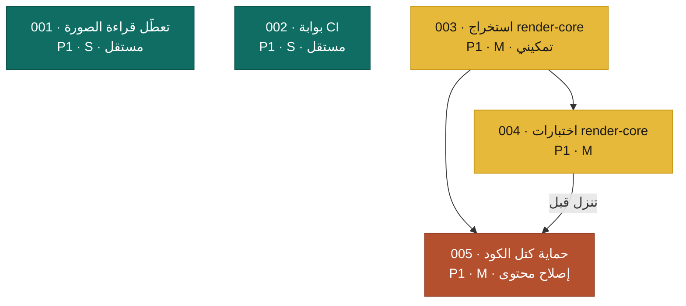

# خطط إصلاح Matn

أُنشئت بمنهجية `/improve` في 2026-07-08، مقابل commit `0046350`.
المنفّذ: **Sonnet 5**. اقرأ كل خطة كاملة قبل البدء، والتزم بشروط التوقّف (STOP)، وحدّث صفّك في الجدول أدناه عند الانتهاء.

كل خطة مكتفية بذاتها (المنفّذ لم يرَ الفحص ولا هذه المحادثة). نفّذ بالترتيب أدناه ما لم تفرض التبعيّات غير ذلك.

## ترتيب التنفيذ والحالة

| الخطة | العنوان | الأولوية | الجهد | يعتمد على | الحالة |
|-------|---------|:--------:|:-----:|-----------|--------|
| 001 | إصلاح تعطّل الخادم عند قراءة صورة | P1 | S | — | DONE |
| 002 | تحقّق CI من بناء الديمو ومن الصياغة | P1 | S | — | DONE |
| 003 | استخراج دوال العرض النقية إلى وحدة قابلة للاستيراد | P1 | M | — | DONE |
| 004 | اختبارات مميِّزة لوحدة العرض (المهرِّبات + الاتجاه + الرياضيات) | P1 | M | 003 | DONE |
| 005 | حماية كتل الكود من معالِجات الرياضيات وتجريد `
` | P1 | M | 003، 004 | DONE |
| 006 | خارطة المنتج: قارئ محلي وذاكرة قراءة وتنقّل | — | — | 001–005 | DONE |
| 007 | دراسة المنافسين والمصادر المفتوحة | — | — | 006 | DONE |
| 008 | خارطة التنفيذ التنافسية | — | — | 007 | TODO |

قيم الحالة: TODO · IN PROGRESS · DONE · BLOCKED (بسبب سطر واحد) · REJECTED (بسبب سطر واحد).

## رسم التبعيّة

## ملاحظات التبعيّة

- **004 و005 يعتمدان على 003**: الدوال النقية (`esc`، `safeHref`، `extractMath`، `voteDir`…) محبوسة داخل `<script>` مضمّن في `src/index.html`، فلا يمكن استيرادها للاختبار حتى تُستخرَج في 003.
- **004 ينزل قبل 005**: إصلاح كتل الكود (005) يعدّل `extractMath` ومعالِج تجريد `
`؛ إنزال الاختبارات المميِّزة أولاً (004) يضمن أن التعديل لا يكسر رياضيات صحيحة.
- **001 و002 مستقلّان تماماً** — نفّذهما أولاً (سريعان وبلا مخاطر).

## أوامر التحقّق (من هذا المستودع)

| الغرض | الأمر | المتوقّع عند النجاح |
|-------|-------|---------------------|
| الاختبارات | `npm test` | كل الاختبارات تمرّ |
| بناء الديمو | `node scripts/build-docs.mjs` | آخر سطر `build-docs: ok` |
| فحص الصياغة | `node --check <file.mjs>` | خروج 0، بلا مخرجات |

المشروع بلا lint ولا typecheck ولا formatter (قيد مقصود: بلا تبعيات، بلا خطوة بناء).

## أعراف المستودع (التزمها)

- **بلا تبعيات تشغيل، وبلا خطوة بناء (bundler)**: `package.json` بلا `dependencies`. لا تُضِف أي تبعية تشغيل ولا أداة بناء. الأصول مضمّنة يدوياً في `vendor/`.
- **بعد أي تعديل على `src/index.html`**: أعِد بناء الديمو (`node scripts/build-docs.mjs`) والتزم `docs/` معه.
- **نمط الالتزام**: conventional commits (`fix:`، `feat:`، `refactor:`، `docs:`) — أمثلة في `git log`.
- **الأمان**: `esc` و`safeHref` (في `src/index.html`) هما حاجز XSS الوحيد؛ لا تُضعِفهما. الخادم محصور بجذر احتواء عبر `realpathSync`+`withinRoot` (`src/server.mjs`).
- **فرع لكل خطة**: `advisor/NNN-<slug>`. لا تدفع ولا تفتح PR ما لم يُطلب.

## نتائج فُحصت ولم تُخطَّط (كي لا يُعاد فحصها)

هذه وُثِّقت في [AUDIT.md](./AUDIT.md) لكن لم يُطلب تخطيطها بعد. ليست مرفوضة — مؤجّلة:

- **F8** لا مستمع `error` على `listen` (`server.mjs:185`) — إصلاح S، مؤجّل.
- **F9** `render()` بلا حارس في مساري السحب/الاختيار (`index.html:628,692`) — S.
- **F10** تسرّب مراقبي `fs.watch` (`server.mjs:38-47`) — M.
- **F11** تصدير EPUB بعناصر HTML5 فارغة (`index.html:677`) — M.
- **F4/F12** تحصين أمني (تحقّق Host، CSP) — تحصين دفاعي، لا ثغرة فاعلة.
- طفيفة: تصادم رموز PUA النادر، حارس بثّ SSE، تنظيف لقطات PNG محلية.
