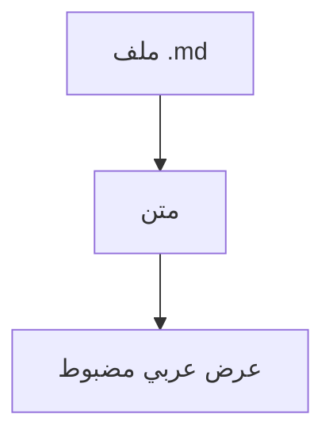

# متن · Matn

**قارئ ماركداون عربي** من اليمين إلى اليسار، يعمل في متصفحك. هذه صفحة تجربة حيّة — بدّل **السمة** و**الخط** و**الحجم** من زرّ الإعدادات ⚙، أو افتح ملفك عبر 📁 أو بسحبه إلى الصفحة. اضغط `/` للبحث داخل المستند.

## لماذا متن

الطرفية وكثير من المحرّرات تعرض العربية مكسورة: بلا اتجاه ثنائي، ووصل حروف متقطّع. متن يصيّر كل كتلة بضبط `dir="auto"`، فتنساب العربية يميناً ويبقى الكود والإنجليزية LTR.

يفهم روابط الويكي مثل [[صفحة]] و[[هدف|اسم ظاهر]] كما في أوبسيديان.

## مخططات Mermaid



## صناديق التنبيه

> [!NOTE]
> يفهم متن صناديق التنبيه بأسلوب GitHub وأوبسيديان.

> [!TIP] نصيحة
> استعمل `matn ملفك.md` من الطرفية، أو اجعله المعالِج الافتراضي للنقر المزدوج.

> [!WARNING]
> النقر المزدوج على أي `.md` في النظام يفتحه هنا — بعد إعداد بسيط.

## أمثلة كود

```python
def greet(name: str) -> str:
    return f"مرحباً يا {name}!"

print(greet("علي"))
```

## قائمة المهام

- [x] اتجاه RTL لكل كتلة
- [x] Mermaid وصناديق تنبيه و wikilinks
- [x] بحث داخل المستند، فهرس، تلوين
- [ ] معادلات KaTeX (قريباً)

## جدول مقارنة

| الميزة | متن | محرّر عادي |
|---|---|---|
| اتجاه RTL | تام | جزئي |
| خطوط عربية | ٥ مضمّنة | حسب النظام |
| تصدير PDF | نعم | أحياناً |

## رياضيات وحواشٍ

معادلة سطرية $a^2 + b^2 = c^2$ ومعادلة كتلة:

$$\int_0^\infty e^{-x^2}\,dx = \frac{\sqrt{\pi}}{2}$$

ويدعم الحواشي السفلية[^ftn] بأسلوب GitHub.

[^ftn]: تظهر الحاشية أسفل المستند مع رابط رجوع.

## التثبيت

```bash
npm install -g Ajarallah/matn
npx github:Ajarallah/matn file.md
```
