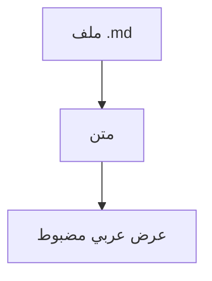

# متن · Matn

**قارئ ماركداون عربي** من اليمين إلى اليسار، يعمل في متصفحك. هذه صفحة تجربة حيّة. اختر **نمط القراءة** و**السمة** و**الخط** من الإعدادات، أو افتح ملفك من زر **فتح** أو بسحبه إلى الصفحة. اضغط `/` للبحث داخل المستند.

## لماذا متن

تعرض الطرفية وكثير من المحرّرات العربية باتجاه مضطرب وحروف متقطعة. يضبط متن كل كتلة بحسب لغة المستند الغالبة، فتُقرأ العربية من اليمين إلى اليسار ويبقى الكود والإنجليزية LTR.

يفهم روابط الويكي مثل [[صفحة]] و[[هدف|اسم ظاهر]]، ويحفظ موضع القراءة والتعليقات والمفضلة محليًا.

## مخططات Mermaid


```mermaid
flowchart TD
  A[ملف .md] --> B[متن]
  B --> C[عرض عربي مضبوط]
```

## صناديق التنبيه

> [!NOTE]
> يعرض متن صناديق التنبيه بأسلوب GitHub وأوبسيديان.

> [!TIP] نصيحة
> استعمل `matn ملفك.md` من الطرفية، أو اجعله المعالِج الافتراضي للنقر المزدوج.

> [!WARNING]
> افتح أي ملف `.md` بنقرة مزدوجة بعد تعيين متن قارئًا تلقائيًا.

## أمثلة كود

```python
def greet(name: str) -> str:
    return f"مرحباً يا {name}!"

print(greet("علي"))
```

## قائمة المهام

- [x] اتجاه RTL لكل كتلة
- [x] Mermaid وصناديق تنبيه وروابط ويكي
- [x] بحث وخريطة مستند وتلوين للكود
- [x] معادلات KaTeX وحواشٍ
- [x] تعليقات ومفضلة ووضع كتاب

## جدول مقارنة

| الميزة | متن | محرّر عادي |
|---|---|---|
| اتجاه RTL | تام | جزئي |
| خطوط عربية | ٥ مضمّنة | حسب النظام |
| تصدير PDF | نعم | أحياناً |

## رياضيات وحواشٍ

معادلة سطرية $a^2 + b^2 = c^2$ ومعادلة كتلة:

$$\int_0^\infty e^{-x^2}\,dx = \frac{\sqrt{\pi}}{2}$$

ويدعم الحواشي السفلية[^ftn] بأسلوب GitHub.

[^ftn]: تظهر الحاشية أسفل المستند مع رابط رجوع.

## التثبيت

```bash
npm install -g @ajarallah/matn
matn file.md
```
